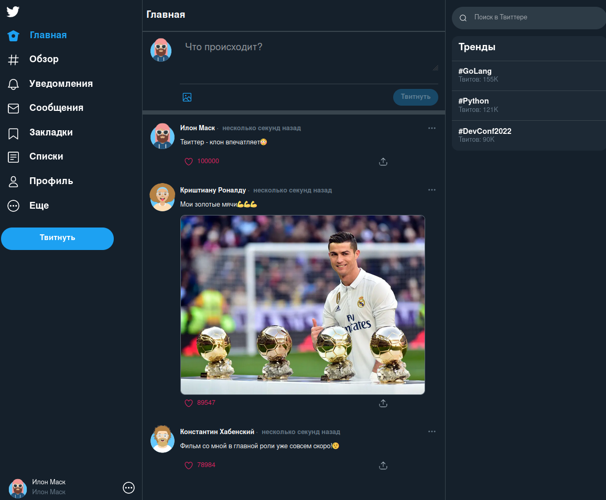

# Социальная сеть Twitter-Clone!
___
# Главная страница

___
# Возможности системы:
* ### __Пользователь может добавить новый твит.__
* ### __Пользователь может удалить свой твит.__
* ### __Пользователь может зафоловить другого пользователя.__
* ### __Пользователь может отписаться от другого пользователя.__
* ### __Пользователь может отмечать твит как понравившийся.__
* ### __Пользователь может убрать отметку «Нравится».__
* ### __Пользователь может получить ленту из твитов отсортированных в порядке убывания по количеству лайков и дате создания.__
* ### __Твит может содержать картинку.__

___
# Общая информация:
### 1) *Проект был написан на веб - фреймворке **FastAPI** по уже готовым шаблонам.*
### 2) *Основные использованные технологии для реализации backend составляющей:*
* ### [FastAPI](https://fastapi.tiangolo.com/)
* ### [SQLAlchemy](https://www.sqlalchemy.org/)
* ### [Alembic](https://alembic.sqlalchemy.org/en/latest/)
* ### [Aiofiles](https://pypi.org/project/aiofiles/)
* ### [Pytest](https://pypi.org/project/pytest/)

___
## Разделы проекта:
1) #### Приложение:
   ##### * ___src/main.py___

2) #### Шаблоны:
   ##### * ___static___ - директория со статическими файлами

3) #### Конфигурационные файлы и директории:
   ##### * ___nginx___ - директория с настройкой Nginx
   ##### * ___.env_template___ - файл с настройками виртуального окружения
   ##### * ___.gitignore___ - файл с настройками системы контроля версий
   ##### * ___alembic.ini___ - файл с настройками Alembic
   ##### * ___pytest.ini___ - файл с настройкой Pytest
   ##### * ___Dockerfile___ - файл со сборкой приложения
   ##### * ___docker-compose.yml___ - файл со сборкой всего проекта
   ##### * ___requirements.txt___ - файл с зависимостями, необходимыми для работы проекта

4) #### Тесты:
   ##### * ___tests___ - директория с тестами проекта

5) #### Документация:
   ##### * ___README.md___ - файл с документацией по работе и установке проекта

___
## __Параметры файла .env_template__:
#### DB_HOST - Хост базы данных
#### DB_PORT - Порт базы данных
#### POSTGRES_USER - Логин пользователя 
#### POSTGRES_PASSWORD - Пароль пользователя
#### POSTGRES_DB - Название базы данных

___
## Установка и запуск проекта в несколько простых шагов:

1) ### Клонирование репозитория:
```sh
git clone https://github.com/raydqver/social-network.git
```
2) ### Создание файла .env:

#### __Заполните его теми параметрами, которые есть в .env_template. При необходимости параметры можно изменить__

3) ### Запуск проекта с помощью docker-compose (убедитесь, что docker-compose установлен на вашем устройстве):
```sh
docker compose up
```

### Если приложение упало с ошибкой, остановите все контейнеры и выполните команду заново.
___
## Запуск тестов:
1) ### Переход в директорию tests:
```sh
cd tests
```
2) ### Создание файла .env:

#### __Заполните его теми параметрами, которые есть в .env_template. Без надобности не меняйте параметры по умолчанию.__

3) ### Запуск тестов с помощью docker-compose (убедитесь, что docker-compose установлен на вашем устройстве):
```sh
docker compose up
```
### Если приложение упало с ошибкой, остановите все контейнеры и выполните команду заново.

### __Создайте пользователя через интерактивную документацию http://127.0.0.1:8000/docs#/Users/create_user_api_users_post методом POST или базу данных.__
### __По умолчанию загружается страница http://localhost/login с пользователем, у которого токен test.__

